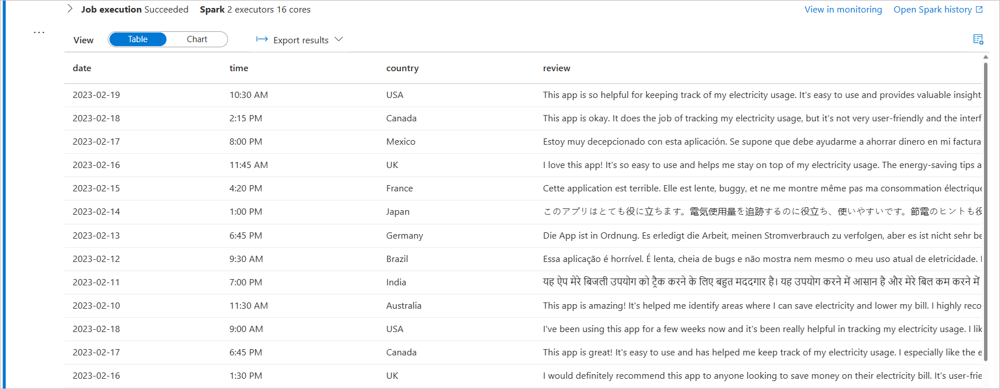
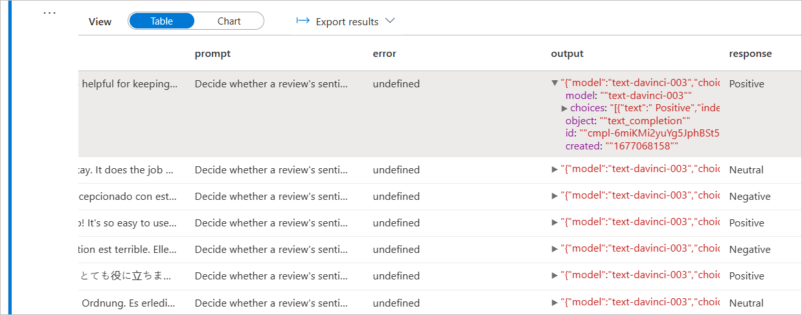
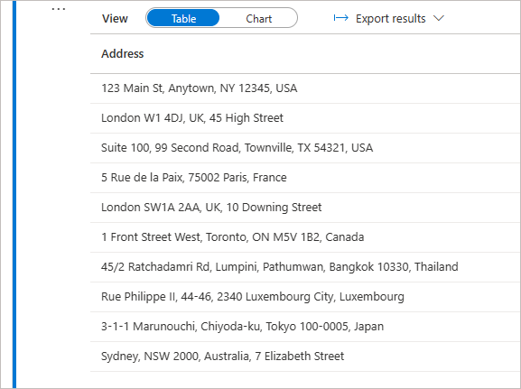
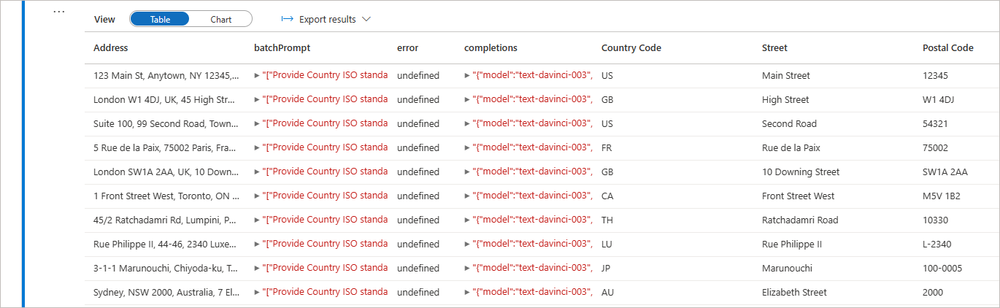

# How to leverage Azure OpenAI in Azure Synapse Analytics

In this tutorial we will leverage Azure OpenAI service from a Synapse Analytics workspace using the [SynapseML](https://microsoft.github.io/SynapseML/docs/about/) library.

The [OpenAICompletion](https://mmlspark.blob.core.windows.net/docs/0.10.0/pyspark/synapse.ml.cognitive.html#module-synapse.ml.cognitive.OpenAICompletion) module offers numerous possibilities for its application. For example, suppose your data has been collected in an inconsistent or non-standardized manner, resulting in poor data quality. In that case, you can use OpenAICompletion to standardize, enrich your data and implementing data quality changes that may be challenging to achieve with conventional coding techniques.

## Prerequisites

- Azure Synapse Analytics Workspace
- Azure OpenAI service
- Storage account
- Azure Key Vault

## Setup

1. If you haven't already, create an Azure OpenAI resource and in the OpenAI Studio select the model you wish to deploy. For detailed instructions see [here](https://learn.microsoft.com/azure/cognitive-services/openai/how-to/create-resource?pivots=web-portal). In this sample we used the ```text-davinci-003``` model.
1. Upload the csv sample data into your storage account. The sample data can be found on this repo under the sample-data folder.
1. Open your Synapse workspace.
1. Open the Data tab and connect your workspace with the storage account. You should be abe to see the csv files listed.
1. Open the Develop tab, and import the notebooks in this repository into your Synapse Analytics workspace.

## Use Case - Get sentiment from review

Let's say you're working on a project where you need to classify customer reviews of a product as positive, neutral or negative, which can help businesses make more informed decisions about their products and marketing strategies. You have a dataset of customer reviews in different languages and without rating.

In the first cell we will load the csv file into a dataframe.

```python
df = spark.read.load('abfss://<storage_account_name>@<container_name>.dfs.core.windows.net/reviews.csv', format='csv', header=True)
```



In the next cell we will define the [OpenAICompletion](https://mmlspark.blob.core.windows.net/docs/0.10.0/pyspark/synapse.ml.cognitive.html#module-synapse.ml.cognitive.OpenAICompletion) API call and add a new column to the dataframe with the corresponding prompt for each row. The key to access the OpenAI service will be retrieved from Key Vault using the find_secret function.

After making the call, the output will be presented in a JSON format, containing the result as well as several other details in the designated column. Subsequently, we will create a new column named response specifically for the sentiment value.

```python
from pyspark.sql.functions import *
from synapse.ml.cognitive import OpenAICompletion
from synapse.ml.core.platform import find_secret

openai_service = "<your_openai_service_name>"
openai_deployment = "<your_openai_deployment_name>"

# Get OpenAI key
key = find_secret("<your_openai_secret_name>", "<your_keyvault_service_name>")

# API call definition
completion = (
    OpenAICompletion()
        .setSubscriptionKey(key)
        .setDeploymentName(openai_deployment)
        .setUrl("https://<your_openai_service_name>.openai.azure.com/")
        .setPromptCol("prompt")
        .setErrorCol("error")
        .setOutputCol("output")
)

# Define prompt to get review's sentiment
df = df.withColumn("prompt", 
  udf(lambda review: "Decide whether a review's sentiment is positive, neutral, or negative. Review: " + review + " Sentiment: ", StringType())(col("review"))
)

df_completion = completion.transform(df).withColumn("response", col("output.choices.text").getItem(0))

```



## Use Case - Get address information from unstandardized data

Suppose that due to the lack of standardized data collection practices, your data contains various formats for addresses, making it challenging to perform analysis. In the example bellow we leverage batch prompt of OpenAICompletion to standardize the address format across the dataframe.



```python
from synapse.ml.cognitive import OpenAICompletion
from synapse.ml.core.platform import find_secret

openai_service = "<your_openai_service_name>"
openai_deployment = "<your_openai_deployment_name>"

key = find_secret("<your_openai_secret_name>", "<your_keyvault_service_name>")

# API call definition
completion = (
    OpenAICompletion()
        .setSubscriptionKey(key)
        .setDeploymentName(openai_deployment)
        .setUrl("https://<your_openai_service_name>.openai.azure.com/")
        .setMaxTokens(200)
        .setBatchPromptCol("batchPrompt")
        .setErrorCol("error")
        .setOutputCol("completions")
)

# Create a batchPrompt where each row as multiple prompts
df = df.withColumn("batchPrompt", 
    udf(lambda address: [
          "Provide Country ISO standard two-letter code for the following address: " + address,
          "Provide the street name for the following address: " + address,
          "Provide the postal code of the following address: " + address
    ], ArrayType(StringType()))(col("Address"))
)

completed_batch_df = batch_completion.transform(df).cache()

# Create a new column for each completion result
completed_batch_df = completed_batch_df.withColumn("Country Code", col("completions.choices.text").getItem(0))
completed_batch_df = completed_batch_df.withColumn("Street", col("completions.choices.text").getItem(1))
completed_batch_df = completed_batch_df.withColumn("Postal Code", col("completions.choices.text").getItem(2))

display(completed_batch_df)

```


